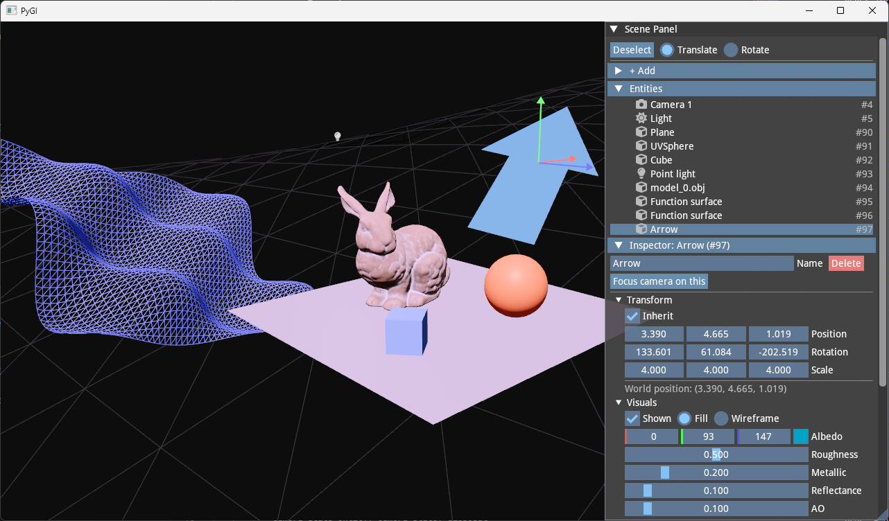

# PyGl

Computer Graphics assignment. [View the write-up](docs/main.pdf).



# Setup

## Prerequisites

- Python 3.10 or higher.
- A system that supports OpenGL 4.5 or higher. (OpenGL 4.1 if on macOS)

## Installation

```bash
git clone https://github.com/nghiaho310pf/PyGl
cd https://github.com/nghiaho310pf/PyGl

python -m venv .venv
source .venv/bin/activate  # On Windows: venv\Scripts\activate

pip install -r requirements.txt
```

## Running

```bash
python src/main.py
```

## Troubleshooting

- If you encounter errors related to OpenGL versions, ensure your graphics drivers are up to date. You can check your OpenGL version using tools like `glxinfo` (Linux) or `GPU-Z` (Windows).
- Make sure you have activated your virtual environment and that all dependencies in `requirements.txt` are installed successfully.
- The application uses the `trimesh` library for model loading. If certain model formats (e.g., `.glb`) fail to load, ensure you have the necessary sub-dependencies installed (e.g., `pip install trimesh[all]`).
